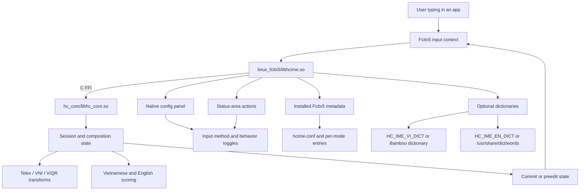

# HC_IME

HC_IME is a Linux-first Vietnamese input method for Fcitx5. The project is
split into a Rust composition engine and a thin C++ addon that exposes the
engine through the native Fcitx5 runtime.

For the current validated project snapshot, see [docs/STATUS.md](docs/STATUS.md).

The goal is to keep the typing logic auditable while still behaving like a real
desktop input method:

- Telex, VNI, and VIQR input modes
- live preedit composition and commit handling
- raw-keystroke replay for invalid or partially corrected sequences
- Vietnamese syllable validation with spell-check fallback
- optional Vietnamese and English dictionary lookups
- native Fcitx5 configuration and status-area controls
- shared-library delivery through a small C FFI surface

## Architecture



The data flow is intentionally narrow:

1. Fcitx5 delivers key events to the addon.
2. The C++ addon translates those events into the Rust request/state ABI.
3. The Rust core renders the composition, applies mode-specific transforms, and
   decides whether to keep the preedit or commit raw text.
4. The addon reflects that state back into Fcitx5, along with config and status
   actions for the user.

## Repository Layout

- `hc_core/`: Rust engine, session state, and exported C ABI
- `linux_fcitx5/`: Fcitx5 addon, metadata, config files, and install rules
- `scripts/`: local validation helpers, including the e2e smoke gate
- `docs/`: research notes and project documentation
- `CMakeLists.txt`: top-level build entrypoint

## Engine Scope

The Rust engine currently handles:

- Telex, VNI, and VIQR composition
- tone and diacritic transforms
- invalid-sequence recovery and undo/reconversion behavior
- spell-check status tracking for valid, invalid, and English-fallback cases
- raw and composed commit decisions through the exported ABI

The Fcitx5 addon currently provides:

- one primary `HC_IME` input method
- direct `HC_IME Telex`, `HC_IME VNI`, and `HC_IME VIQR` entries
- a native configuration panel for input method and behavior toggles
- status-area actions that mirror the same runtime switches

## Build

```bash
cargo test --manifest-path hc_core/Cargo.toml
cmake -S . -B build -DFCITX_INSTALL_USE_FCITX_SYS_PATHS=ON
cmake --build build
sudo cmake --install build
fcitx5 -r
```

For a user-local install that does not touch `/usr`:

```bash
cmake -S . -B build-user -G Ninja -DCMAKE_INSTALL_PREFIX="$HOME/.local"
cmake --build build-user
cmake --install build-user
fcitx5 -r
```

## Native UI

Open the Fcitx5 configuration UI with:

```bash
fcitx5-configtool
```

The generated HC_IME settings panel includes:

- `Input method`
- `Use legacy tone placement`
- `Validate Vietnamese words with dictionaries and rules`
- `Restore invalid Vietnamese sequences to raw keystrokes`
- `Underline the preedit text`
- `Vietnamese dictionary path`
- `English dictionary path`

To keep Bamboo installed while using HC_IME as the default Vietnamese typing
path, set the Fcitx5 profile default to `hcime` and leave `bamboo` in the same
input-method group.

## Validation

Run the local end-to-end smoke gate with:

```bash
scripts/e2e-smoke.sh
```

The smoke gate formats and tests the Rust core, runs Clippy when available,
builds the addon, stages the install layout, verifies the Fcitx5 metadata,
checks shared-library resolution, and confirms the Rust ABI exports used by the
addon.

For staging without touching `/usr`, install into a temporary prefix:

```bash
cmake -S . -B build
cmake --build build
cmake --install build --prefix /tmp/hcime-install-smoke
```

## Packaging

The install rules place:

- `libhcime.so` in the Fcitx5 addon directory
- `libhc_core.so` alongside the addon for runtime loading
- `hcime.conf` in the addon metadata directory
- the per-mode inputmethod configs in the Fcitx5 inputmethod directory

The top-level `.gitignore` keeps generated build trees, `hc_core/target`, and
local tooling state out of the repository.
