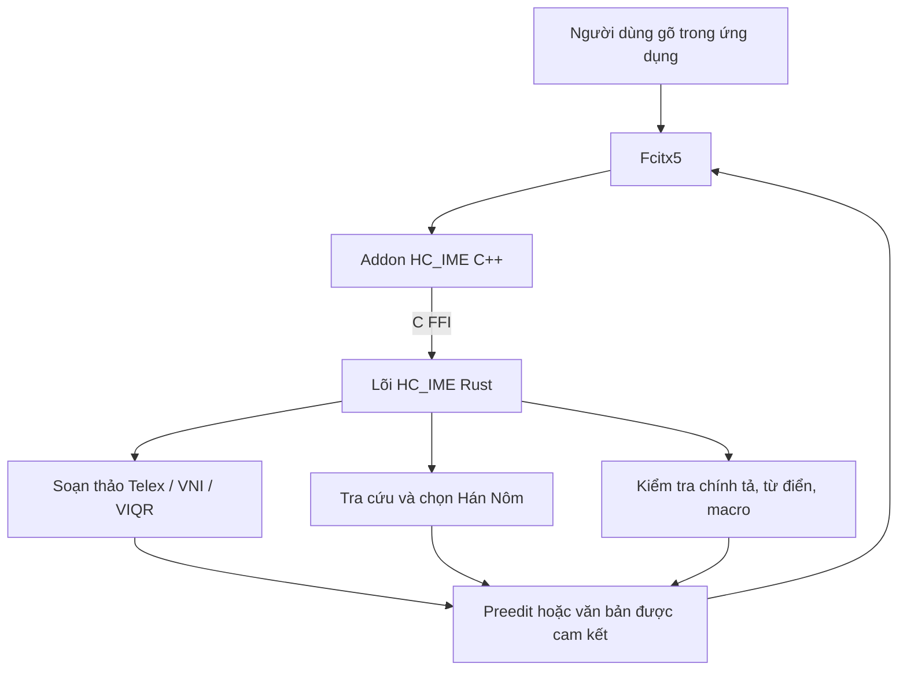

# HC_IME

HC_IME là bộ gõ tiếng Việt ưu tiên Linux, tích hợp trực tiếp với Fcitx5. Dự án
kết hợp lõi soạn thảo bằng Rust với addon C++ mỏng để mang trải nghiệm gõ tiếng
Việt và Hán Nôm vào các ứng dụng máy tính để bàn.

Trạng thái đã được kiểm chứng của mã nguồn nằm tại
[docs/STATUS.md](docs/STATUS.md).

## Tính năng

- Gõ tiếng Việt theo Telex, VNI và VIQR.
- Soạn thảo Hán Nôm theo Telex, VNI và VIQR, với từ điển nhúng đa nguồn.
- Hiển thị ứng viên Hán Nôm ngay khi đang gõ âm đọc.
- Khôi phục chuỗi gõ thô, hoàn tác/chuyển đổi lại và kiểm tra chính tả tiếng
  Việt.
- Tra cứu từ điển tiếng Việt và tiếng Anh tùy chọn.
- Mở rộng phụ âm nhanh, bảo vệ từ tiếng Anh ba mức, macro và phím `Esc` để
  khôi phục chuỗi gõ thô.
- Cấu hình riêng theo ứng dụng, ghi nhớ chế độ Việt/Anh và lựa chọn đầu ra
  preedit hoặc surrounding-text.
- Bảng cấu hình gốc và các hành động trạng thái của Fcitx5.

## Cách hoạt động



1. Fcitx5 gửi phím bấm cho addon HC_IME.
2. Addon chuyển phím và cấu hình hiện thời sang lõi Rust qua C FFI.
3. Lõi áp dụng quy tắc gõ, từ điển và trạng thái phiên, rồi trả về preedit,
   danh sách ứng viên hoặc văn bản cần cam kết.
4. Addon cập nhật giao diện Fcitx5 hoặc chèn văn bản qua surrounding-text,
   tùy khả năng của ứng dụng và cấu hình đã chọn.

## Gõ tiếng Việt

Ba chế độ tiếng Việt thông thường là `Telex`, `VNI` và `VIQR`. Lõi xử lý dấu,
biến đổi dấu mũ/dấu râu, hoàn tác và các chuỗi không hợp lệ. Khi bật kiểm tra
chính tả, HC_IME có thể dùng quy tắc âm tiết cùng các từ điển ngoài để phân biệt
từ tiếng Việt và tiếng Anh.

Các tùy chọn đáng chú ý:

- `Quick consonants`: mở rộng nhanh như `cc` → `ch`, `nn` → `ng`, `f` → `ph`.
- `English protection`: bảo vệ tiếng Anh theo mức `Off`, `Soft` hoặc `Hard`.
- `Macro file path`: nạp macro theo định dạng `phím=từ thay thế`.
- `ESC restores raw keystrokes`: trả lại chuỗi phím ban đầu khi đang soạn.

## Gõ Hán Nôm

Chọn `Hán Nôm (Telex)`, `Hán Nôm (VNI)` hoặc `Hán Nôm (VIQR)` trong HC_IME.
Gõ âm đọc như bình thường; danh sách chữ Hán Nôm phù hợp sẽ xuất hiện ngay bên
dưới preedit. Mỗi ứng viên có nhãn `1.` đến `9.` và phần chú thích là âm đọc
hiện tại.

| Thao tác | Kết quả |
| --- | --- |
| `1`–`9` | Chọn ứng viên tương ứng trên trang hiện tại. |
| `Space` | Chọn ứng viên đầu tiên. |
| `Enter` khi chưa bôi chọn | Cam kết nguyên âm đọc Quốc ngữ. |
| `Enter` khi đã bôi chọn | Cam kết chữ Hán Nôm đang bôi chọn. |
| `↑` `↓` `←` `→`, `Tab`, `Shift+Tab` | Di chuyển vùng bôi chọn. |
| `PageUp` / `PageDown`, `-` / `=`, `[` / `]` | Chuyển trang ứng viên. |
| Dấu câu ASCII | Cam kết ứng viên đầu tiên rồi chèn dấu câu. |
| `Esc` | Quay lại pha gõ âm đọc khi đang duyệt ứng viên. |

Từ điển Hán Nôm nhúng được tạo từ Unihan, NomStandardization, cake_gao và
pearapple123. Bản hiện tại chứa 7.114 âm đọc và 19.134 ký tự, trong đó có
14.297 ký tự Nôm thuộc Extension B trở lên.

## Cấu hình Fcitx5

Mở công cụ cấu hình Fcitx5:

```bash
fcitx5-configtool
```

Mục HC_IME có các nhóm cấu hình cho chế độ gõ, hành vi, đường dẫn từ điển, quy
tắc theo ứng dụng và cách xuất văn bản. Các hành động chuyển chế độ và bật/tắt
một số tùy chọn cũng xuất hiện ở vùng trạng thái Fcitx5; có thể gán phím tắt
cho chúng bằng `fcitx5-configtool`.

Để giữ Bamboo cài đặt song song nhưng dùng HC_IME mặc định, đặt `hcime` làm
phương thức nhập mặc định trong profile Fcitx5 và giữ `bamboo` trong cùng nhóm
phương thức nhập.

## Cài đặt và biên dịch

Yêu cầu: Rust/Cargo, CMake, Ninja, Fcitx5 và gói phát triển Fcitx5.

```bash
cargo test --manifest-path hc_core/Cargo.toml
cmake -S . -B build -G Ninja -DFCITX_INSTALL_USE_FCITX_SYS_PATHS=ON
cmake --build build
sudo cmake --install build
fcitx5 -r
```

Cài đặt vào thư mục người dùng, không ghi vào `/usr`:

```bash
cmake -S . -B build-user -G Ninja -DCMAKE_INSTALL_PREFIX="$HOME/.local"
cmake --build build-user
cmake --install build-user
fcitx5 -r
```

## Kiểm chứng

Chạy cổng kiểm thử đầu-cuối của dự án:

```bash
scripts/e2e-smoke.sh
```

Script này kiểm tra định dạng Rust, chạy kiểm thử và Clippy, biên dịch addon,
chạy bridge probe Fcitx5, cài đặt vào vùng tạm, rồi xác minh metadata, liên kết
thư viện và các ABI Rust cần thiết.

Để kiểm tra bố cục cài đặt vào một thư mục tạm riêng:

```bash
cmake -S . -B build -G Ninja
cmake --build build
cmake --install build --prefix /tmp/hcime-install-smoke
```

## Cấu trúc mã nguồn

- `hc_core/`: lõi Rust, trạng thái phiên, từ điển Hán Nôm và C ABI.
- `linux_fcitx5/`: addon Fcitx5, metadata, cấu hình và quy tắc cài đặt.
- `scripts/`: công cụ kiểm chứng cục bộ và bộ dựng từ điển Hán Nôm.
- `docs/`: tài liệu dự án; `docs/STATUS.md` là nguồn sự thật cục bộ.
- `CMakeLists.txt`: điểm vào cho bản dựng CMake.
