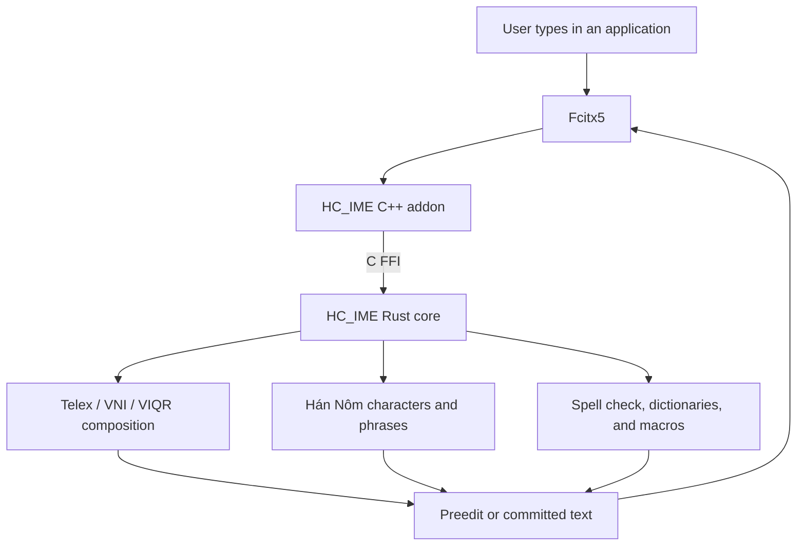

# HC_IME

HC_IME is a Linux-first Vietnamese input method for Fcitx5. It combines a Rust
composition engine with a thin C++ addon, providing Vietnamese and Hán Nôm
input through Fcitx5's native desktop runtime.

For the current validated snapshot, see [docs/STATUS.md](docs/STATUS.md).

## Features

- Vietnamese input with Telex, VNI, and VIQR.
- Hán Nôm input with Telex, VNI, and VIQR readings.
- Live character and two-word phrase candidates while composing a reading.
- Local phrase-ranking learning, with a reset control and no network service.
- Raw-keystroke recovery, undo/reconversion, and Vietnamese spell checking.
- Optional Vietnamese and English dictionaries.
- Quick consonant expansion, three-level English protection, macros, and raw
  keystroke restore with `Esc`.
- Per-application behavior, smart Vietnamese/English mode switching, and
  preedit or surrounding-text output.
- Native Fcitx5 configuration and status-area actions.

## Architecture



1. Fcitx5 sends key events to the HC_IME addon.
2. The addon passes keys and active configuration to the Rust session through
   C FFI.
3. The Rust core applies composition rules and dictionary lookup, then returns
   preedit text, candidates, or committed text.
4. The addon updates Fcitx5's input panel, or applies surrounding-text output
   when that mode is available and selected.

## Vietnamese Input

Choose `Telex`, `VNI`, or `VIQR`. The core handles tone and shape transforms,
invalid-sequence recovery, and raw-input replay. When spell checking is
enabled, it combines Vietnamese syllable rules with optional dictionaries to
avoid applying Vietnamese transforms to English text.

Notable settings include:

- `Quick consonants`: expansions such as `cc` → `ch`, `nn` → `ng`, and
  `f` → `ph`.
- `English protection`: `Off`, `Soft`, or `Hard` protection for English words.
- `Macro file path`: macros in `key=replacement` format.
- `ESC restores raw keystrokes`: restores the original keys during composition.

## Hán Nôm Input

Choose `Hán Nôm (Telex)`, `Hán Nôm (VNI)`, or `Hán Nôm (VIQR)`. As you type a
Vietnamese reading, HC_IME shows bold Hán Nôm candidate glyphs with labels
`1.`–`9.` and the full Vietnamese reading as a comment. Fcitx5 owns
the candidate pages, so every ranked result remains available rather than
being cut off after the first nine.

HC_IME also predicts common two-word phrases. After typing the first reading,
press `Space` once to start the second reading and show phrase typeahead.
After typing the second reading, exact phrase candidates are ranked before
generated two-character fallbacks. Phrase prediction and local ranking learning
can each be turned off in the Fcitx5 configuration or status area.

| Key or action | Result |
| --- | --- |
| `1`–`9` | Commit the corresponding candidate on the current page in Telex/VIQR, or after candidate focus in VNI. Unfocused Hán Nôm VNI digits remain tone/shape composition triggers. |
| `Space` after the first reading | Start phrase composition and show phrase predictions. |
| `Space` during phrase composition | Commit the top phrase candidate followed by a literal space. |
| `Enter` with no focused candidate | Commit the raw Quốc ngữ reading. |
| `Enter` with a focused candidate | Commit the focused Hán Nôm character or phrase. |
| Arrow keys, `Tab`, `Shift+Tab` | Move the candidate focus. |
| `PageUp` / `PageDown`, `-` / `=`, `[` / `]` | Change candidate pages. |
| ASCII punctuation | Commit the top candidate followed by the punctuation. |
| `Esc` / `Backspace` | Step back through phrase composition or editing. |

The embedded character dictionary is built from Unihan, NomStandardization,
cake_gao, and pearapple123. The phrase dictionary contains 11,153 validated
two-word `(reading, glyphs)` pairs; alternatives for one reading are retained.
Single-glyph and phrase selections share bounded local ranking data (normalized
reading, glyphs, count, timestamp) and can be reset from the status area.

`Dictionary/HanNomPhraseDictionaryPath` accepts an optional offline TSV with
`reading<TAB>glyphs` rows. It accepts exactly two Vietnamese tokens and two
CJK glyphs, ignores comments and malformed rows, and gives valid user rows
priority. The loader is bounded to 2 MiB and 50,000 data rows and runs only on
configuration/session reset, never while typing.

## Fcitx5 Configuration

Open the native configuration tool:

```bash
fcitx5-configtool
```

HC_IME provides settings for input modes, typing behavior, phrase prediction
and learning, dictionary paths, per-application rules, and output mode. The
status area also exposes mode switches plus toggles for spell checking,
auto-restore, underline, quick consonants, phrase prediction, phrase learning,
and reset of local Hán Nôm learning.

Candidate font size is controlled by the active Fcitx5 UI (ClassicUI or
Kimpanel), not by HC_IME. A ClassicUI font change is global to all input
methods; configure and verify it in the active UI rather than expecting a
per-HC_IME font setting.

To keep Bamboo installed while making HC_IME the default Vietnamese input
method, set `hcime` as the default in the Fcitx5 profile and leave `bamboo` in
the same input-method group.

## Build and Install

Requirements: Rust/Cargo, CMake, Ninja, Fcitx5, and the Fcitx5 development
packages.

```bash
cargo test --manifest-path hc_core/Cargo.toml
cmake -S . -B build -G Ninja -DFCITX_INSTALL_USE_FCITX_SYS_PATHS=ON
cmake --build build
sudo cmake --install build
fcitx5 -r
```

For a user-local installation that does not write to `/usr`:

```bash
cmake -S . -B build-user -G Ninja -DCMAKE_INSTALL_PREFIX="$HOME/.local"
cmake --build build-user
cmake --install build-user
fcitx5 -r
```

## Validation

Run the repository's end-to-end smoke gate:

```bash
scripts/e2e-smoke.sh
```

The gate checks Rust formatting, deterministically regenerates both embedded
Hán Nôm dictionaries, runs Rust tests and Clippy, builds the addon, runs the
Fcitx5 bridge probe, stages installation, and verifies metadata, linkage, and
the exported Rust ABI.

## Repository Layout

- `hc_core/`: Rust engine, session state, embedded dictionaries, and C ABI.
- `linux_fcitx5/`: Fcitx5 addon, metadata, configuration, and install rules.
- `scripts/`: validation helpers and the Hán Nôm dictionary builder.
- `docs/`: project documentation; `docs/STATUS.md` is the local source of
  truth.
- `CMakeLists.txt`: top-level CMake entry point.
