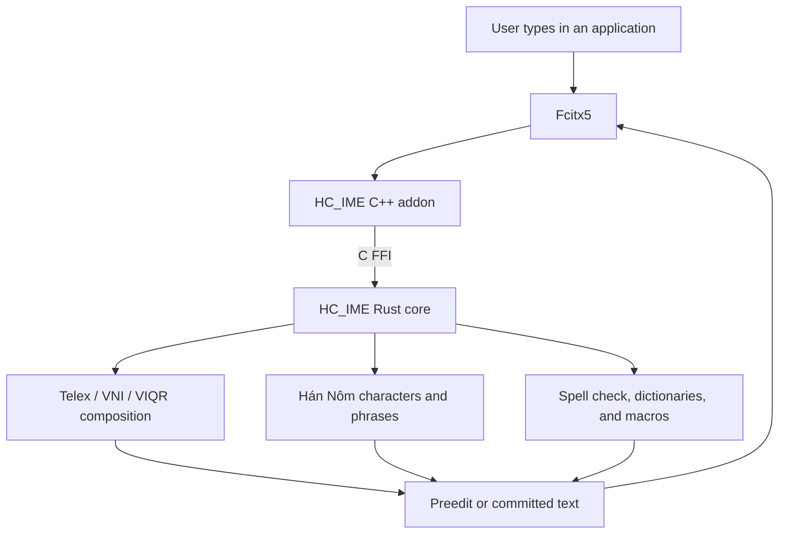

# HC_IME

HC_IME is a Linux-first Vietnamese input method for Fcitx5. It combines a Rust
composition engine with a thin C++ addon, providing Vietnamese and Hán Nôm
input through Fcitx5's native desktop runtime.

For the current validated snapshot, see [docs/STATUS.md](docs/STATUS.md).

## Features

- Vietnamese input with Telex, VNI, and VIQR.
- Hán Nôm input with Telex, VNI, and VIQR readings.
- Live character and two-word phrase candidates while composing a reading.
- Local phrase-ranking learning, with a reset control and no network service.
- Raw-keystroke recovery, undo/reconversion, and Vietnamese spell checking.
- Optional Vietnamese and English dictionaries.
- Quick consonant expansion, three-level English protection, macros, and raw
  keystroke restore with `Esc`.
- Per-application behavior, smart Vietnamese/English mode switching, and
  preedit or surrounding-text output.
- Native Fcitx5 configuration and status-area actions.

## Architecture


```mermaid
graph TD
    U[User types in an application] --> F[Fcitx5]
    F --> A[HC_IME C++ addon]
    A -->|C FFI| R[HC_IME Rust core]
    R --> V[Telex / VNI / VIQR composition]
    R --> H[Hán Nôm characters and phrases]
    R --> D[Spell check, dictionaries, and macros]
    V --> O[Preedit or committed text]
    H --> O
    D --> O
    O --> F
```

1. Fcitx5 sends key events to the HC_IME addon.
2. The addon passes keys and active configuration to the Rust session through
   C FFI.
3. The Rust core applies composition rules and dictionary lookup, then returns
   preedit text, candidates, or committed text.
4. The addon updates Fcitx5's input panel, or applies surrounding-text output
   when that mode is available and selected.

## Vietnamese Input

Choose `Telex`, `VNI`, or `VIQR`. The core handles tone and shape transforms,
invalid-sequence recovery, and raw-input replay. When spell checking is
enabled, it combines Vietnamese syllable rules with optional dictionaries to
avoid applying Vietnamese transforms to English text.

Notable settings include:

- `Quick consonants`: expansions such as `cc` → `ch`, `nn` → `ng`, and
  `f` → `ph`.
- `English protection`: `Off`, `Soft`, or `Hard` protection for English words.
- `Macro file path`: macros in `key=replacement` format.
- `ESC restores raw keystrokes`: restores the original keys during composition.

## Hán Nôm Input

Choose `Hán Nôm (Telex)`, `Hán Nôm (VNI)`, or `Hán Nôm (VIQR)`. As you type a
Vietnamese reading, HC_IME shows Hán Nôm candidate glyph rows with labels
`1.`–`9.`. Fcitx5 owns the candidate pages, so every ranked result remains
available rather than being cut off after the first nine.

HC_IME also predicts common two-word phrases. After typing the first reading,
press `Space` once to start the second reading and show phrase typeahead.
After typing the second reading, exact phrase candidates are ranked before
generated two-character fallbacks. Phrase prediction and local ranking learning
can each be turned off in the Fcitx5 configuration or status area.

| Key or action | Result |
| --- | --- |
| `1`–`9` | Commit the corresponding candidate on the current page in Hán Nôm Telex/VIQR. In Hán Nôm VNI, digits always apply Vietnamese tone/shape composition; use the arrow keys and `Enter` to select a glyph. |
| `Space` after the first reading | Start phrase composition and show phrase predictions. |
| `Space` during phrase composition | Keep composing and leave phrase candidates visible. |
| `Enter` with no focused candidate | Commit the top Hán Nôm candidate for a complete two-word phrase; otherwise commit the raw Quốc ngữ reading. |
| `Enter` with a focused candidate | Commit the focused Hán Nôm character or phrase. |
| Arrow keys, `Tab`, `Shift+Tab` | Move the candidate focus. |
| `PageUp` / `PageDown`, `-` / `=`, `[` / `]` | Change candidate pages. |
| ASCII punctuation | Commit the top candidate followed by the punctuation. |
| `Esc` / `Backspace` | Step back through phrase composition or editing. |

The embedded character dictionary is built from Unihan, NomStandardization,
cake_gao, and pearapple123. The phrase dictionary contains 11,153 validated
two-word `(reading, glyphs)` pairs; alternatives for one reading are retained.
Single-glyph and phrase selections share bounded local ranking data (normalized
reading, glyphs, count, timestamp) and can be reset from the status area.

`Dictionary/HanNomPhraseDictionaryPath` accepts an optional offline TSV with
`reading<TAB>glyphs` rows. It accepts exactly two Vietnamese tokens and two
CJK glyphs, ignores comments and malformed rows, and gives valid user rows
priority. The loader is bounded to 2 MiB and 50,000 data rows and runs only on
configuration/session reset, never while typing.

## Fcitx5 Configuration

Open the native configuration tool:

```bash
fcitx5-configtool
```

HC_IME provides settings for input modes, typing behavior, phrase prediction
and learning, dictionary paths, per-application rules, and output mode. The
status area also exposes mode switches plus toggles for spell checking,
auto-restore, underline, quick consonants, phrase prediction, phrase learning,
and reset of local Hán Nôm learning.

Candidate font size and family fallbacks are controlled by the active Fcitx5 UI
(ClassicUI or Kimpanel), not by HC_IME. A ClassicUI font change is global to all
input methods; configure and verify it in the active UI rather than expecting a
per-HC_IME font setting. The tested ClassicUI Pango font description is
`Hanom PV,HAN NOM B,HAN NOM A,Noto Sans CJK SC,Jigmo,Jigmo2,Jigmo3 28`; the
trailing `28` sets the candidate size, and HC_IME leaves the glyph text at the
fonts' regular weight.

To keep Bamboo installed while making HC_IME the default Vietnamese input
method, set `hcime` as the default in the Fcitx5 profile and leave `bamboo` in
the same input-method group.

## Install

Deeper documentation lives in `docs/`: [INSTALL.md](docs/INSTALL.md) for setup,
installation, and checking a machine, [UNINSTALL.md](docs/UNINSTALL.md) for
removal including the manual path, and
[ARCH_CACHYOS_PLAN.md](docs/ARCH_CACHYOS_PLAN.md) for the outstanding
Arch/CachyOS work.

### Guided install (Ubuntu and Debian)

Run the installer from the repository root. It works on a clean machine that has
no Rust, Fcitx5, or CJK fonts, and equally on a machine that already has some of
them:

```bash
./scripts/install.sh
```

It first shows what is already in place and what is not, then walks through the
missing pieces one at a time:

```
  #  Component                      Status
  ─────────────────────────────────────────────────────────────────
  1  Build + Fcitx5 packages (apt)  ✓ all present
  2  Hán Nôm fonts                  ✗ missing: fonts-hanazono
  3  Rust toolchain                 ✓ rustc 1.97.1
  4  Build the addon and run tests  ✗ not built yet
  5  Install the addon system-wide  ✗ not installed
                                   ↳ needs root
  6  Register hcime with Fcitx5     ✗ not in the group
  7  Candidate window font          ✗ a different font is set
                                   ↳ applies to EVERY input method, not just hcime
  8  Input-method environment       ✓ environment already points at fcitx

  a) install what is missing  (2 4 5 6 7)
  c) choose components yourself
  q) quit
```

Pick `a` for everything still missing, or `c` to enter component numbers such as
`4 5`. Each step then prints the exact command it is about to run and waits:
`Enter` to run it, `s` to skip it, `q` to stop. If a step fails, it offers
`r` to retry, `s` to skip, `q` to stop — one failure does not abandon the run,
and Fcitx5 is restarted if a failed step had stopped it.

Re-running the installer is safe and is the intended way to continue: it
re-detects everything and only offers what is still missing. That also makes it
the way to install a single piece later — say the fonts you skipped the first
time.

To see the same table without changing anything:

```bash
./scripts/install.sh --status
```

Both invocations work, and neither requires you to start as root:

```bash
./scripts/install.sh          # sudo is used only for apt and `cmake --install`
sudo ./scripts/install.sh     # the build and every ~/.config change run as you
```

For CI or scripting, `-y` skips the guided run and installs everything in order,
with the older flags still available (`./scripts/install.sh --help` lists them
all):

| Option | Effect |
| --- | --- |
| `-y`, `--yes` | Answer yes to everything; run the whole install unattended. |
| `--skip-tests` | Skip `cargo test` before building. |
| `--no-fonts` | Do not install the Hán Nôm CJK fonts. |
| `--no-config` | Install only; do not touch your Fcitx5 configuration. |

Every configuration file the installer changes is backed up next to the
original with a `.hcime-backup-<timestamp>` suffix, and what it installs is
recorded in `~/.local/share/hcime/receipt.ini` so the uninstaller knows what it
may remove. After it finishes, switch input methods with `Ctrl+Space` and open
`fcitx5-configtool` to choose Telex / VNI / VIQR or a Hán Nôm mode. If
applications do not pick up the input method, log out and back in.

**If you currently use IBus (the Ubuntu default) or any framework other than
Fcitx5**, HC_IME will not respond until you make Fcitx5 the active input
framework. The installer does not switch it for you; run this and then log out
and back in:

```bash
im-config -n fcitx5   # switch back later with: im-config -n ibus
```

The installer prints this reminder at the end when it detects an IBus session.

> **Ubuntu 24.04 note.** The Fcitx5 packaged in 24.04 may be older than the
> version this addon targets (`hcime.conf` declares `core:5.1.19`). Fcitx5
> refuses to load an addon whose declared dependency is newer than the running
> core, so on stock 24.04 the addon may build but never load. Check with:
>
> ```bash
> pkg-config --modversion Fcitx5Core   # compare against 5.1.19
> ```
>
> The installer warns when it detects an older version. If it is below 5.1.19,
> install a newer Fcitx5 (from a PPA or by building from source) and re-run.
> Ubuntu 26.04 ships a recent enough Fcitx5.

### Updating after a code change

Once a machine has been through the installer, changing the source does not call
for another install. Run the updater instead:

```bash
./scripts/update.sh
```

It rebuilds the Rust core and the Fcitx5 addon incrementally, reinstalls them
over the existing installation, and restarts Fcitx5. It never touches apt, the
fonts, or anything under `~/.config`, so settings you have adjusted since the
install — the candidate font, your input-method group, per-application rules —
are left exactly as they are.

| Option | Effect |
| --- | --- |
| `--skip-tests` | Skip `cargo test` before rebuilding. |
| `--force` | Reinstall even when the rebuild produced no change. |

When the rebuild produces nothing new, the updater says so and leaves the
running Fcitx5 alone instead of restarting it. It refuses to run if it finds no
previous installation (it looks for the manifest at
`~/.local/share/hcime/install_manifest.txt`); run `./scripts/install.sh` first.
On distributions other than Debian and Ubuntu it prints the equivalent rebuild
commands.

### Uninstalling

```bash
./scripts/uninstall.sh
```

It lists what HC_IME put on the machine and lets you take off only the parts you
want — for example the addon while keeping the fonts, or the fonts while keeping
everything else:

```
  #  Component                      What happens
  ─────────────────────────────────────────────────────────────────
  1  Installed addon (.so + .conf)  ✓ 4 file(s) from the manifest
  2  hcime in the Fcitx5 profile    ✓ remove from the group, hand DefaultIM to another IM
  3  Candidate window font          ✓ restore from classicui.conf.hcime-backup-…
  4  Environment drop-in            ✓ remove 90-hcime-fcitx5.conf
  5  Hán Nôm font packages (apt)    ✓ fonts-hanazono
  ─  Fcitx5 and build packages      NOT removed
```

Two guarantees worth knowing:

- **Fcitx5 is never removed.** Uninstalling HC_IME leaves your input-method
  framework, and every other input method using it, untouched.
- **No apt package is removed unless this installer is the one that installed
  it.** That is what the receipt is for: a package that was already on the
  machine is never a candidate, and shows in the table as such.

Restoring the candidate-window font also comes from the backup taken at install
time, so a font you had configured before HC_IME comes back as it was. Backups
themselves are always left in place.

### Manual build and install

Requirements: Rust/Cargo, CMake, Ninja, Fcitx5, and the Fcitx5 development
packages.

```bash
cargo test --manifest-path hc_core/Cargo.toml
cmake -S . -B build -G Ninja -DFCITX_INSTALL_USE_FCITX_SYS_PATHS=ON
cmake --build build
sudo cmake --install build
fcitx5 -r
```

For a user-local installation that does not write to `/usr`:

```bash
cmake -S . -B build-user -G Ninja -DCMAKE_INSTALL_PREFIX="$HOME/.local"
cmake --build build-user
cmake --install build-user
fcitx5 -r
```

## Validation

Run the repository's end-to-end smoke gate:

```bash
scripts/e2e-smoke.sh
```

The gate checks Rust formatting, parses the installer scripts and runs their
status screen, deterministically regenerates both embedded Hán Nôm dictionaries,
runs Rust tests and Clippy, builds the addon, runs the Fcitx5 bridge probe,
stages installation, and verifies metadata, linkage, and the exported Rust ABI.

## Repository Layout

- `hc_core/`: Rust engine, session state, embedded dictionaries, and C ABI.
- `linux_fcitx5/`: Fcitx5 addon, metadata, configuration, and install rules.
- `scripts/`: the guided installer (`install.sh`), updater (`update.sh`),
  uninstaller (`uninstall.sh`), validation helpers, and the Hán Nôm dictionary
  builder.
- `docs/`: project documentation. `STATUS.md` is the local source of truth;
  `INSTALL.md`, `UNINSTALL.md`, and `ARCH_CACHYOS_PLAN.md` cover setup, removal,
  and the Arch/CachyOS port.
- `CMakeLists.txt`: top-level CMake entry point.
