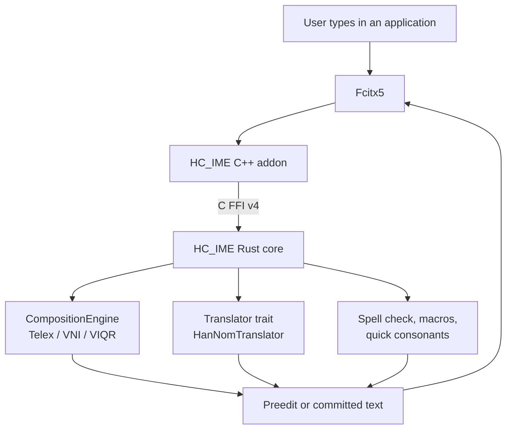

# HC_IME

HC_IME is a Linux-first Vietnamese input method for Fcitx5. It combines a Rust
composition engine with a thin C++ addon, providing Vietnamese and Hán Nôm
input through Fcitx5's native desktop runtime.

For the current validated snapshot, see [docs/STATUS.md](docs/STATUS.md).

## Features

- Vietnamese input with Telex, VNI, and VIQR.
- Hán Nôm input with Telex, VNI, and VIQR readings.
- Live character and two-word phrase candidates while composing a reading.
- Local phrase-ranking learning (single glyphs and phrases), with a reset
  control and no network service.
- Raw-keystroke recovery, undo/reconversion, tone placement, and Vietnamese
  spell checking.
- Optional Vietnamese and English dictionary lookup (reloaded on config change).
- Quick consonant expansion (mid-word, start-of-word, end-of-word variants).
- Three-level English protection (`Off`, `Soft`, `Hard`) to avoid applying
  Vietnamese transforms to English text.
- Macro expansion on space/enter/boundary commit, with an `MacroInEnglish`
  toggle. Shared globally via `OnceLock`.
- `Esc` restores raw keystrokes during composition (configurable toggle).
- Per-application exclusion, forced-Vietnamese apps, and smart Vietnamese/
  English mode switching.
- Per-app output strategy: `SurroundingTextApps` and `PreeditApps` override the
  global `Preedit` / `SurroundingText` output mode.
- Surrounding-text re-sync guard detects application-side text mutations and
  recovers cleanly.
- Native Fcitx5 configuration and status-area actions.

## Architecture

The Rust core (`hc_core/`) separates **composition** (tone and shape transforms
in `composition.rs`, ~22 fields, zero Hán Nôm knowledge) from **translation**
(pluggable `Translator` trait with `HanNomTranslator` in `translation.rs`).
Pure-Vietnamese mode allocates zero Hán Nôm state.

The FFI is unified through `hc_session_handle_key_v4()` with
`HC_KeyRequestV2`/`HC_KeyResultV2` types. v1/v2 Hán Nôm handlers remain
exported but are `#[deprecated]`.


```mermaid
graph TD
    U[User types in an application] --> F[Fcitx5]
    F --> A[HC_IME C++ addon]
    A -->|C FFI v4| R[HC_IME Rust core]
    R --> C[CompositionEngine<br/>Telex / VNI / VIQR]
    R --> T[Translator trait<br/>HanNomTranslator]
    R --> S[Spell check, macros,<br/>quick consonants]
    C --> O[Preedit or committed text]
    T --> O
    S --> O
    O --> F
```

1. Fcitx5 sends key events to the HC_IME addon.
2. The addon passes keys and active configuration to the Rust session through
   a unified C FFI (`HC_KeyRequestV2` → `HC_KeyResultV2`).
3. The Rust core applies composition rules and optional Hán Nôm translation,
   then returns preedit text, candidates, or committed text.
4. The addon updates Fcitx5's input panel, or applies surrounding-text output
   via `deleteSurroundingText()` with UTF-8-safe delta computation.

The C++ addon (`linux_fcitx5/`) is refactored into `HcImeKeyHandler`,
`HcImeCandidateAdapter`, and `HcImeStatusMenu` components.

Dictionary loading uses `memmap2` for zero-copy file-based access, falling back
to `include_bytes!` embedded data. Path resolution is cross-platform via the
`dirs` crate.

## Vietnamese Input

Choose `Telex`, `VNI`, or `VIQR`. The core handles tone and shape transforms,
invalid-sequence recovery, and raw-input replay. When spell checking is
enabled, it combines Vietnamese syllable rules with optional dictionaries to
avoid applying Vietnamese transforms to English text.

VNI mode includes specialized handling for English words containing Telex
trigger characters (`s`, `f`, `r`, `x`, `j`, `w`, `z`).

Notable settings include:

- `Quick consonants`: mid-word expansions (`cc`→`ch`, `gg`→`gi`, `nn`→`ng`,
  `uu`→`ư`), start-of-word (`f`→`ph`, `j`→`gi`, `w`→`qu`), and end-of-word
  (`g`→`ng`, `h`→`nh`, `k`→`ch`).
- `English protection`: `Off`, `Soft`, or `Hard` protection for English words.
- `Macro file path`: macros in `key=replacement` format. `MacroInEnglish`
  toggle allows expansion in English-mode contexts.
- `ESC restores raw keystrokes`: restores the original keys during composition.

## Hán Nôm Input

Choose `Hán Nôm (Telex)`, `Hán Nôm (VNI)`, or `Hán Nôm (VIQR)`. As you type a
Vietnamese reading, HC_IME shows Hán Nôm candidate glyph rows with up to 256
ranked candidates. Fcitx5 owns the candidate pages (`CommonCandidateList`), so
every ranked result remains available through paging.

HC_IME also predicts common two-word phrases. After typing the first reading,
press `Space` once to start the second reading and show phrase typeahead.
After typing the second reading, exact phrase candidates are ranked before
generated two-character fallbacks. Phrase prediction and local ranking learning
can each be turned off in the Fcitx5 configuration or status area.

| Key or action | Result |
| --- | --- |
| `1`–`9` | Commit the corresponding candidate on the current page in Hán Nôm Telex/VIQR. In Hán Nôm VNI, digits always apply Vietnamese tone/shape composition; use the arrow keys and `Enter` to select a glyph. |
| `Space` after the first reading | Start phrase composition and show phrase predictions. |
| `Space` during phrase composition | Keep composing and leave phrase candidates visible. |
| `Enter` with no focused candidate | Commit the top Hán Nôm candidate for a complete two-word phrase; otherwise commit the raw Quốc ngữ reading. |
| `Enter` with a focused candidate | Commit the focused Hán Nôm character or phrase. |
| Arrow keys, `Tab`, `Shift+Tab` | Move the candidate focus. |
| `PageUp` / `PageDown`, `-` / `=`, `[` / `]` | Change candidate pages. |
| ASCII punctuation | Commit the top candidate followed by the punctuation. |
| `Esc` / `Backspace` | Step back through phrase composition or editing. |

The embedded character dictionary (7,079 final readings) is built from Unihan,
NomStandardization, cake_gao, and pearapple123. The phrase dictionary contains
11,153 validated two-word `(reading, glyphs)` pairs; alternatives for one
reading are retained. Single-glyph and phrase selections share bounded local
ranking data (normalized reading, glyphs, count, timestamp, bounded to 2,048
entries, atomic 0600 writes) and can be reset from the status area.

`Dictionary/HanNomPhraseDictionaryPath` accepts an optional offline TSV with
`reading<TAB>glyphs` rows. It accepts exactly two Vietnamese tokens and two
CJK glyphs, ignores comments and malformed rows, and gives valid user rows
priority. The loader is bounded to 2 MiB and 50,000 data rows and runs only on
configuration/session reset, never while typing.

PhraseHistory is lazy-loaded on the first Hán Nôm keystroke, not at session
creation, to avoid OS freezes.

## Fcitx5 Configuration

Open the native configuration tool:

```bash
fcitx5-configtool
```

HC_IME provides settings for input modes, typing behavior, phrase prediction
and learning, dictionary paths, per-application rules, and output mode. The
status area also exposes mode switches plus toggles for spell checking,
auto-restore, underline, quick consonants, phrase prediction, phrase learning,
and reset of local Hán Nôm learning.

**Per-app output strategy**: `SurroundingTextApps` and `PreeditApps` override
the global `OutputMode` (`Preedit` or `SurroundingText`) on a per-application
basis.

**Surrounding-text re-sync guard**: Validates current surrounding text before
computing a diff and recovers cleanly on mismatch.

Candidate font size and family fallbacks are controlled by the active Fcitx5 UI
(ClassicUI or Kimpanel), not by HC_IME. A ClassicUI font change is global to all
input methods; configure and verify it in the active UI rather than expecting a
per-HC_IME font setting. The tested ClassicUI Pango font description is
`Hanom PV,HAN NOM B,HAN NOM A,Noto Sans CJK SC,Jigmo,Jigmo2,Jigmo3 17`; the
trailing `17` sets the candidate size, and HC_IME leaves the glyph text at the
fonts' regular weight. To avoid square characters (□) for Hán Nôm, ensure your
system has fonts covering CJK Extension B+, such as **NomNaTong**, **HanaMinA/B**,
or fonts from the Vietnamese Nôm Preservation Foundation.

To keep Bamboo installed while making HC_IME the default Vietnamese input
method, set `hcime` as the default in the Fcitx5 profile and leave `bamboo` in
the same input-method group.

## Build and Install

Requirements: Rust/Cargo, CMake (≥3.20), Ninja, C++20 compiler, Fcitx5, and the
Fcitx5 development packages.

```bash
cargo test --manifest-path hc_core/Cargo.toml
cmake -S . -B build -G Ninja -DFCITX_INSTALL_USE_FCITX_SYS_PATHS=ON
cmake --build build
sudo cmake --install build
fcitx5 -r
```

For a user-local installation that does not write to `/usr`:

```bash
cmake -S . -B build-user -G Ninja -DCMAKE_INSTALL_PREFIX="$HOME/.local"
cmake --build build-user
cmake --install build-user
fcitx5 -r
```

## Validation

Run the repository's end-to-end smoke gate:

```bash
scripts/e2e-smoke.sh
```

The gate checks Rust formatting, deterministically regenerates both embedded
Hán Nôm dictionaries, runs ~150 Rust unit tests and Clippy, builds the addon
with C++20, links and runs the Fcitx5 bridge probe, stages installation, and
verifies metadata, linkage, and the exported Rust ABI.

## Repository Layout

- `hc_core/`: Rust engine, session state, composition, translation, platform
  paths, quick consonants, and unified C ABI. Tests live in
  `hc_core/src/tests/` (composition, translation, session, FFI).
- `hc_core/data/`: Embedded binary Hán Nôm dictionaries.
- `linux_fcitx5/`: Fcitx5 addon (`hcime.cpp`, `HcImeKeyHandler`,
  `HcImeCandidateAdapter`, `HcImeStatusMenu`), metadata, configuration, and
  install rules.
- `linux_fcitx5/tests/`: Addon bridge probe and integration tests.
- `scripts/`: End-to-end smoke gate and the deterministic Hán Nôm dictionary
  builder (`build_nom_dict.rs`).
- `data/`: Source data for Hán Nôm dictionaries (Unihan, NomStandardization,
  cake_gao, chu_nom).
- `docs/`: Project documentation and Architecture Decision Records.
  `docs/STATUS.md` is the local source of truth.
  `docs/adr/` contains 5 ADRs covering composition/translation separation,
  platform abstraction, additive FFI migration, dictionary loading, and
  shared vs. per-session state.
- `CMakeLists.txt`: Top-level CMake entry point.
